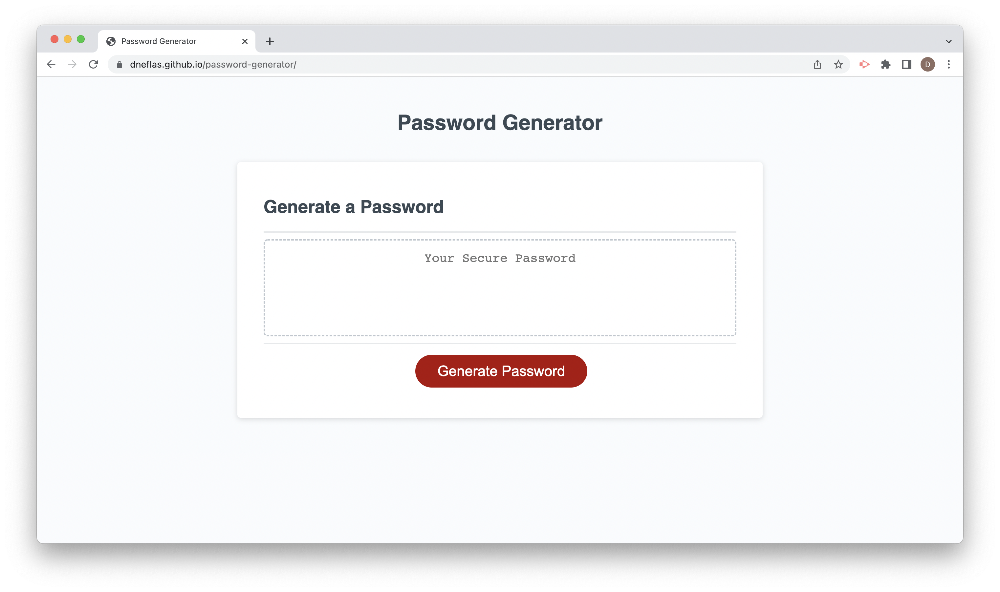

# Password Generator

## Description
The password generator application is designed to generate a random password using the user selected criteria of password length between 8 and 128 characters, and the use of uppercase, lowercase, numeric, and/or special characters. The application was built using Javascript.

https://dneflas.github.io/password-generator/